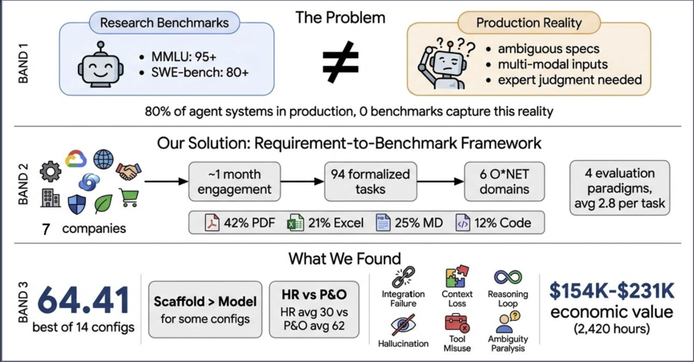
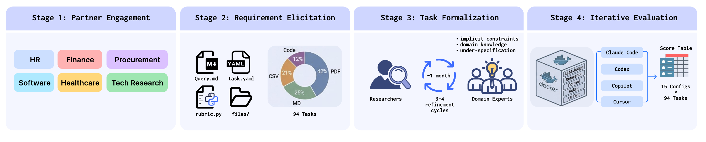
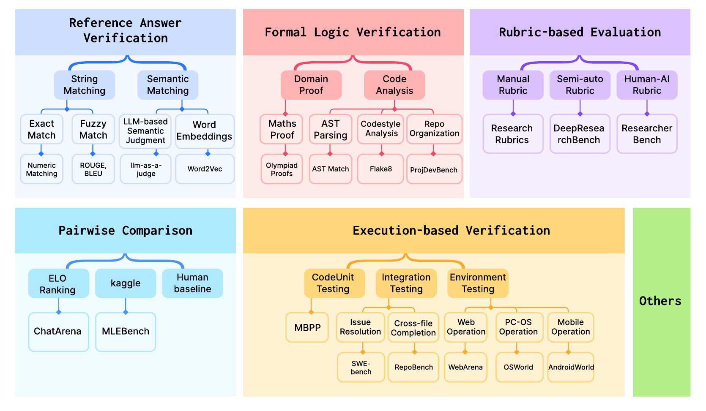

<p align="center">
  <h1 align="center">AlphaEval: Evaluating Agents in Production</h1>
  <p align="center">
    <a href="https://alphaeval.ai">🌐&nbsp;<b>Website</b></a> &nbsp;|&nbsp;
    <a href="paper/AlphaEval_v0.pdf">📄&nbsp;<b>Paper</b></a> &nbsp;|&nbsp;
    <a href="https://github.com/GAIR-NLP/AlphaEval">&nbsp;<b>GitHub</b></a> &nbsp;|&nbsp;
    <a href="README_zh.md"><b>中文</b></a>
  </p>
</p>

<p align="center">
  A production-grounded evaluation framework for AI agents.<br>
  <b>94 tasks</b> from <b>7 companies</b> across <b>6 <a href="https://www.onetonline.org/find/descriptor/browse/2.A">O*NET</a> occupational domains</b>.
</p>

---

<p align="center">
  
  <br><em>Overview of AlphaEval: bridging the gap between research benchmarks and production reality.</em>
</p>

## Highlights

- **From Requirements to Benchmarks** — A systematic framework that transforms authentic production requirements into fully automated, reproducible evaluations. Any real-world business need can be rapidly operationalized into a rigorous benchmark.
- **Production-Grounded Tasks** — 94 tasks preserving real-world complexity: ambiguous specifications, multi-modal inputs (PDFs, Excel, code, images), implicit constraints, and domain-expert evaluation criteria.
- **Multi-Paradigm Evaluation** — Multiple evaluation paradigms (Reference Verification, Formal Logic, Rubric-based, Execution-based) composed per task (avg. 2.8 types/task), with Docker-sandboxed execution and LLM-as-Judge as a cross-cutting method.
- **Agent System Evaluation** — Evaluates complete agent products (Claude Code, Codex, GitHub Copilot, Cursor), not just models. Scaffold choice matters as much as model choice.

<p align="center">
  
  <br><em>The requirement-to-benchmark construction framework: Partner Engagement → Requirement Elicitation → Task Formalization → Iterative Evaluation.</em>
</p>

## Key Results

The best configuration (Claude Code + Opus 4.6) achieves only **64.41/100**, revealing a substantial research-production gap.

| Agent Product | Model | Avg Score |
|:--|:--|--:|
| Claude Code | Claude Opus 4.6 | **64.41** |
| Cursor | Claude Opus 4.6 | 61.85 |
| GitHub Copilot | Claude Opus 4.6 | 61.31 |
| GitHub Copilot | GPT-5.2 | 54.91 |
| Codex | Claude Opus 4.6 | 53.45 |

**Key findings:**
- **Scaffold matters as much as model**: Same Opus 4.6 scores 64.41 via Claude Code but 53.45 via Codex — an 11-point spread
- **Extreme domain variance**: Technology Research (avg 62.0) vs Human Resources (avg 30.0)
- **No single score captures readiness**: Inter-domain rank correlations are often statistically insignificant
- **Production-specific failure modes**: Cascade dependency, subjective judgment collapse, information retrieval failures, cross-section logical inconsistency, constraint misinterpretation, and format compliance failures — all invisible to coding-centric benchmarks

## Task Domains

Tasks are classified following the [O*NET](https://www.onetonline.org/find/descriptor/browse/2.A) occupational taxonomy:

| Domain | Tasks | Description |
|:--|--:|:--|
| Human Resources | 11 | Resume screening against job descriptions |
| Finance & Investment | 22 | Investment research, pitch coaching, financial data extraction |
| Procurement & Operations | 23 | BOM cost optimization, procurement data analysis |
| Software Engineering | 11 | Full-stack mini-program development |
| Healthcare & Life Sciences | 16 | Clinical trial eCRF management, healthcare policy analysis |
| Technology Research | 11 | AI industry deep research, technical analysis |

## Quick Start

```bash
# Clone
git clone https://github.com/GAIR-NLP/AlphaEval.git
cd AlphaEval

# Configure
cp config/config.example.yaml config.yaml
# Edit config.yaml with your API keys

# Install
pip install openai pyyaml

# Run evaluation
./run_eval.sh claude-code <task_id>
```

## Evaluation Templates

We provide 6 ready-to-use evaluation templates. Copy one and customize:

```bash
cp -r tasks/.templates/llm_judge tasks/my-new-task
# Edit task.yaml, query.md, and .eval/rubric.json
```

| Template | When to Use | Evaluation Method |
|:--|:--|:--|
| `code_exec` | Verifiable numeric/structured output | Extract answer → compare to expected value |
| `llm_judge` | Subjective quality assessment | LLM judges each rubric point (covered/not) |
| `exact_match` | Single correct answer | String or numeric matching |
| `f1_match` | Select items from a set | Precision / Recall / F1 against ground truth |
| `hybrid` | Numeric accuracy + qualitative quality | Numerical verification + LLM-as-Judge |
| `ui_testing` | Agent builds a web/mobile app | Playwright headless browser + screenshots |

<p align="center">
  
  <br><em>Taxonomy of evaluation methodologies. AlphaEval covers multiple paradigms, composing them per task.</em>
</p>

See [Task Creation Guide](tasks/TASK_CREATION_GUIDE.md) for step-by-step instructions and [examples/](examples/) for fictional demonstration tasks.

## Task Structure

```
tasks/<task-name>/
├── task.yaml              # Metadata: name, category, difficulty, evaluation config
├── query.md               # Task prompt given to the agent
├── files/                 # Input files (PDFs, Excel, images, code, etc.)
└── .eval/
    ├── rubric.py          # Evaluation script
    ├── rubric.json        # Rubric criteria (for llm_judge / hybrid)
    └── ground_truth.json  # Ground truth (for f1_match / code_exec)
```

## Supported Agents

| Agent | Type | Description |
|:--|:--|:--|
| Claude Code | CLI | Anthropic's agentic coding tool |
| Codex | CLI | OpenAI's coding agent |
| GitHub Copilot | CLI | GitHub's coding agent |
| Cursor | CLI | Cursor's AI coding agent |

All agents are invoked via CLI within Docker-sandboxed environments with full output trajectory recording.

## Paper

📄 **[AlphaEval: Evaluating Agents in Production (v0)](paper/AlphaEval_v0.pdf)**

> This is an early version of the paper. It will be further revised and improved. An arXiv version will be released soon.

## Citation

```bibtex
@article{alphaeval2026,
  title={AlphaEval: Evaluating Agents in Production},
  author={Anonymous},
  year={2026}
}
```

## Acknowledgements

We thank Keyu Li, Tianze Xu, and Zhen Huang for their valuable contributions to this project.

## Contact

For questions or collaboration inquiries, please contact: **lupengrui@sjtu.edu.cn**

## License

MIT License — see [LICENSE](LICENSE) for details.
